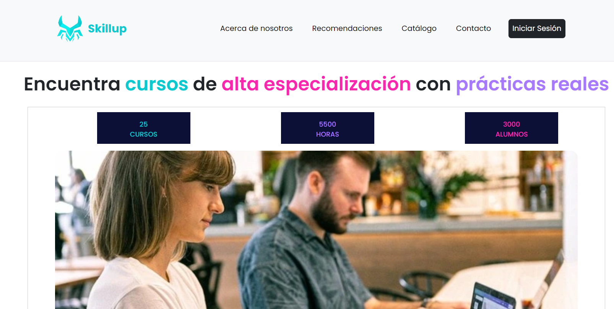
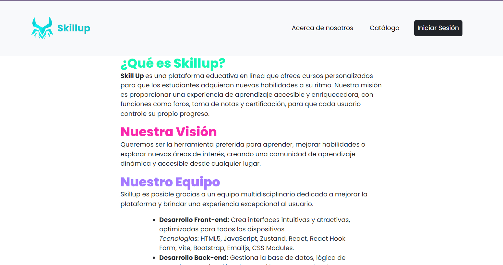
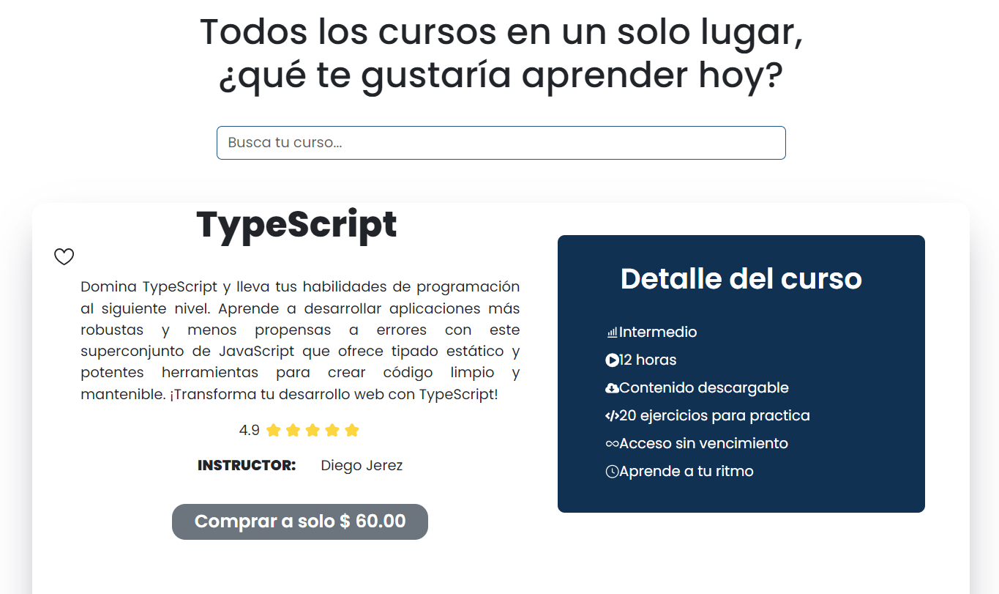
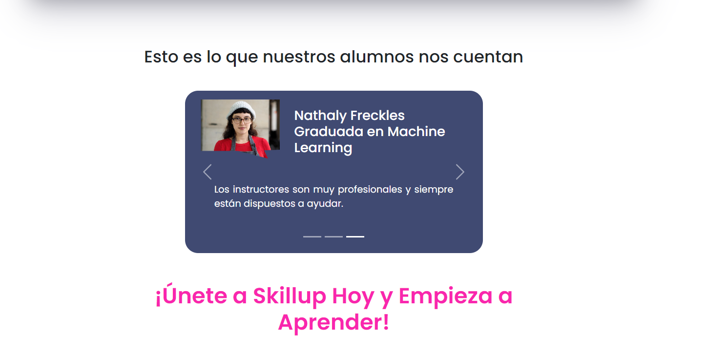
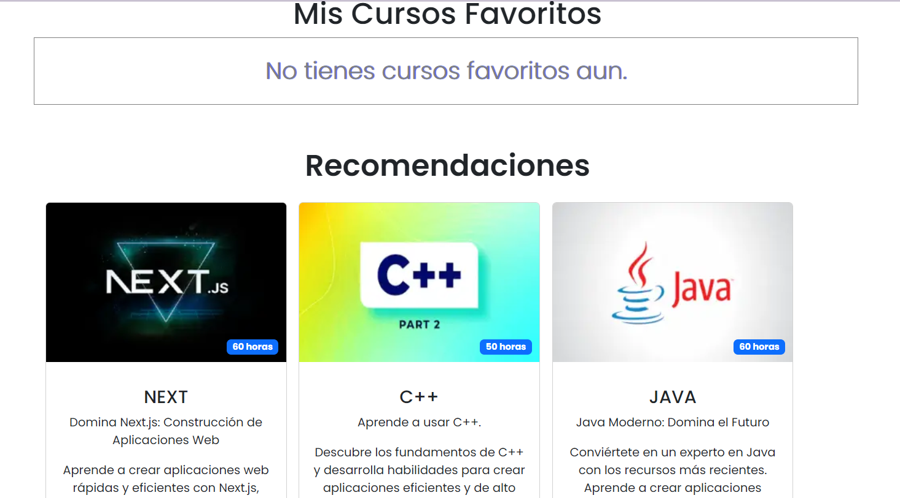
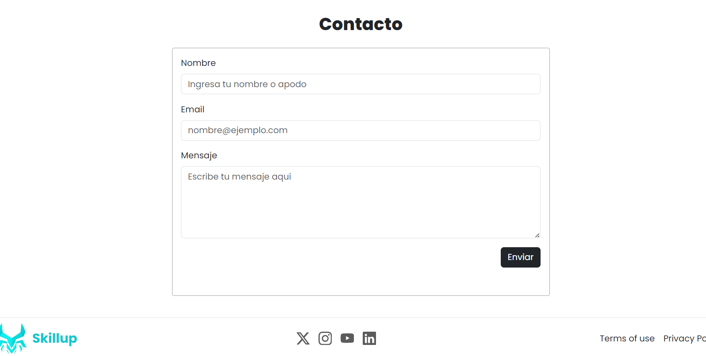
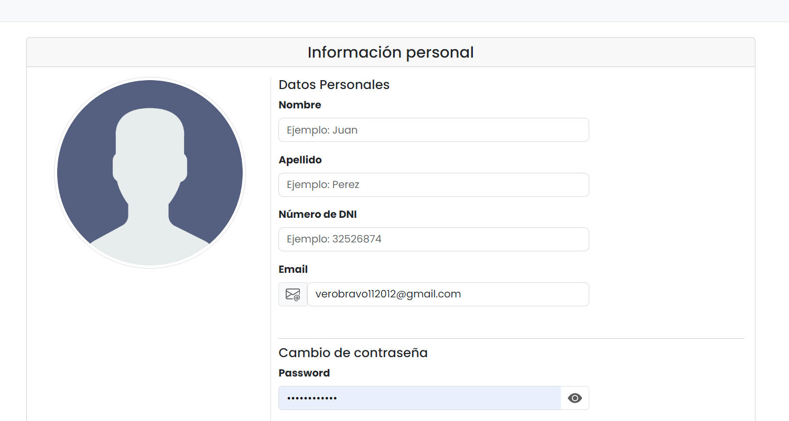
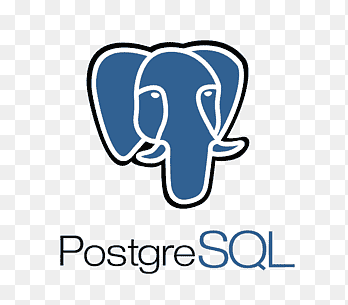

# SKILLUP (Proyecto simulacion No Country)
Skillup es una plataforma de aprendizaje en línea diseñada para ofrecer una amplia variedad de cursos y recursos educativos. Con un enfoque en la personalización y la interacción, Skillup permite a los estudiantes aprender a su propio ritmo y seguir rutas de aprendizaje adaptadas a sus intereses y objetivos.

## Vistas








## Equipo
 
[Nahuel Marcilli - Backend](https://github.com/marili-mn)

[Edwin Ortiz - Fullstack](https://github.com/edarcode)
  
[Veronica Falconi - Frontend](https://github.com/veronicamfalconi)
 
[Veronica Bravo - Frontend](https://github.com/VeronicaBravoDevs)
 
[David Dos Santos - QA](https://github.com/DdSDavid)

[Fernando Cerdeño - Backend](https://github.com/FoxtrotCN)
 
[Jair Rosales Medina - Backend](https://github.com/JairRoMe)
 
[Leonel Giralde - Frontend](https://github.com/LeonelGiralde)
 
[Leonel Giralde - Frontend](https://github.com/tamaracontreras)


## Características Principales

### Gestión de Cuenta:

* ***Registro e Inicio de Sesión***: Los estudiantes pueden registrarse y acceder a la plataforma para explorar los cursos disponibles.

* ***Actualización de Datos Personales***: Los estudiantes pueden mantener su información personal al día, incluyendo nombres, correo y foto de perfil.

### Gestión de Cursos:

* ***Explorar Oferta de Cursos***: Los estudiantes pueden ver y buscar entre una amplia gama de cursos disponibles.

* ***Inscripción en Cursos***: Los estudiantes pueden inscribirse en cursos individuales o rutas de aprendizaje completas.

* ***Seguimiento del Progreso***: Los estudiantes pueden visualizar su progreso en los cursos y ver un historial de cursos completados.

* ***Certificados***: Al completar un curso, los estudiantes pueden recibir un certificado de finalización.

* ***Recomendaciones Personalizadas***: La plataforma sugiere cursos basados en los intereses y el historial de aprendizaje de los estudiantes.

* ***Gestión de Cursos Favoritos y Deseados***: Los estudiantes pueden marcar cursos como favoritos o agregarlos a una lista de deseos para futura inscripción.

<h3 align="left">Diseño</h3>


<h3 align="left">Tecnologias del front</h3>
 


 
 

 

<h3 align="left">Tecnologias del back</h3>


 
 



## SkillUp - Backend 🏢 🌐 🔗

RESTFul API que consumirá la aplicación web SkillUp - FrontEnd

### Indice 📑

- [Descripción](#descripción)
- [Instalación](#instalación)
- [Licencia](#licencia)

### Descripción

SkillUp - Backend es el servidor para la aplicación web de E-Learning de cursos online como parte de la simulación organizada por No Country basado en una arquitectura cliente-servidor. Esta RESTful API privada maneja la administración de cursos, usuarios y seguimiento del progreso, proporcionando la lógica y el almacenamiento necesarios para la plataforma de formación en línea.

### Instalación

SkillUp - Backend está construido en Django, framework de Python. La versión requerida de Python es **3.11**. El ambiente local esta contenerizado en Docker brindando la flexibilidad de portabilidad sin necesidad de instalar dependencias directamente en su local.
Para ejecutar correctamente este proyecto, es necesario seguir estos pasos:

#### 1. Verificar versión de Python:

    En su terminal o CMD correr el siguiente comando:
    python --version (windows)
    python3 --version (MacOS/Linux)

Nota: Si la version instalada es inferior a la requerida por este proyecto, proceda a actualizarla o en su defecto a instalarla desde la documentación oficial de Python:
[Instalación de python](https://www.python.org/downloads/)

#### 2. Clonar el repositorio:

    $ git clone <URL del repositorio>

#### 2.1 Configuración del entorno

Después de clonar este repositorio, necesitarás generar una clave secreta para Django. Esta clave es esencial para la seguridad de la aplicación. Puedes generar una nueva clave secreta utilizando el shell de Django. Sigue estos pasos:

Deben cambiar el nombre del archivo **_.env-example_** a **_.env_**. luego de cambiar el nombre abren el archivo y pegan la clave generada (instrucciones debajo).

### 2.2 Abre el shell de Django

Primero, asegúrate de que tu entorno virtual esté activado. Luego, ejecuta el siguiente comando en la terminal desde el directorio raíz del proyecto:

```bash
python manage.py shell
```

Dentro del shell interactivo de Django, ejecuta el siguiente código:

```
from django.core.management.utils import get_random_secret_key
print(get_random_secret_key())
```

El shell devolverá una cadena de caracteres aleatorios. Copia esta cadena y pegala en el .env como sigue:

```
DJANGO_SECRET_KEY=tu_clave_generada_aqui
```

#### 4. Instalación de Docker y Docker Desktop

Si su editor o IDE no posee las extensiones para manejar docker, proceda a instalarlas en el apartado de extensiones.

_(Se recomienda instalar Docker Desktop por la separación de los entornos y acceso a una serie de herramientas, pero no es estrictamente necesario)_

Para instalar Docker Desktop puede acceder a este enlance:
[Docker Desktop](https://www.docker.com/products/docker-desktop/)

#### 5. Para poner en marcha el servidor web asi como la base de datos, ejecutar el siguiente comando en la terminal:

    $ docker-compose up --build

Esto automaticamente creará los contenedores necesarios para la ejecución de este proyecto, asi como tambien ejecutará los comandos necesarios para hacer migraciones, ejecutarlas e instalar las dependencias necesarias.

### Licencia

#### _c20-14-m-python-react - Equipo de Back End ©2024 Todos los derechos reservados._